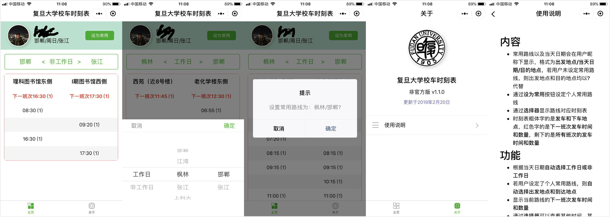

# busschedule-wx


[](http://www.apache.org/licenses/)

Bus schedule of Fudan University hosted on __WeChat Mini Program__ 
capable of detecting current day of week and loading user's personal route when launching the app, 
with a picker for choosing day of week, starting point and destination.


## Screen Shot



## Features

* __The bus schedule will be updated on time (?)__
* A picker for choosing date, starting point and destination
* The exact location of starting point and destination are shown at the table header
* The departure time and amount of the next buses are shown at the second row of the timetable
* The current day of week will be detected and chosen for you when launching the app
* If a personal route has been set, it will be chosen for you when launching the app
* Personal route can be set by clicking the `设为常用` button
* Take user's network status into account
    + If there's no network, change personal route is not allowed
    + If network is disconnected, show toast
    + If network is reconnected, show toast and reload user's info and personal route
* Notice page for bus schedule related notice

## Prerequisites

* Since `wx-server-sdk` is used for cloud functions, 
`wx-server-sdk` dependencies have to be installed at __the root of each cloud function__ via the following command:
```commandline
npm install --save wx-server-sdk@latest
```

## Generate Timetable JSON File

* Modify `INPUT_CSV` and `OUTPUT_JSON` in `files/tojson.py`
* Generate timetable json file:
```
python files/tojson.py
```

## Reference

* [miniprogram-demo](https://github.com/wechat-miniprogram/miniprogram-demo)
* [picker](https://developers.weixin.qq.com/miniprogram/dev/component/picker.html)
* [WeUI](https://github.com/Tencent/weui)

## Links

* [微信公众平台](https://mp.weixin.qq.com/)
* [Official notice on bus schedule of Fudan University](http://www.xyfw.fudan.edu.cn/p2049c1954/list.htm)
* [Map of Fudan University](http://map.fudan.edu.cn)

## Author

Zhongyu Chen
