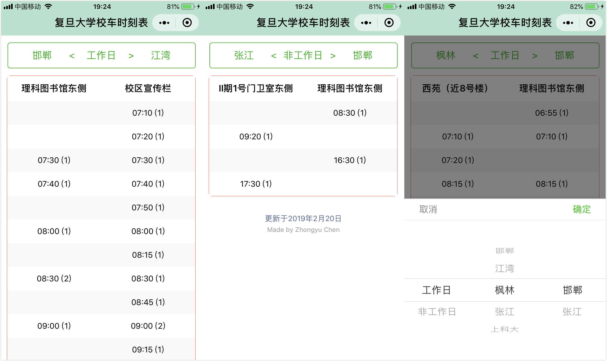

# busschedule-wx

Bus schedule of Fudan University hosted on __WeChat Mini Program__ 
with a picker for choosing date, starting point and destination.

## Screen Shot

## Features

* __The bus schedule will be updated on time (?)__
* A picker for choosing date, starting point and destination
* The exact location of starting point and destination are shown at the table header
* Starting point in picker, exact starting location and departure time at starting point are all on the left
* Destination in picker, exact destination location and departure time at destination are all on the right

### Coming Soon

* 最好能加个定位功能，知道在哪个校区，默认提供本校区前往其他校区的下一班（或三班）车的时间
* 如果可以设置一个闹钟提醒功能就更好
* 能不能每个人有一个默认的两个校区设置，大部分人只在两个校区里穿梭，每次都要选的话其实也很麻烦。

## Reference

* [picker](https://developers.weixin.qq.com/miniprogram/dev/component/picker.html)
* [WeUI](https://github.com/Tencent/weui)

## Links

* [微信公众平台](https://mp.weixin.qq.com/)
* [Official notice on bus schedule of Fudan University](http://www.xyfw.fudan.edu.cn/p2049c1954/list.htm)
* [Map of Fudan University](http://map.fudan.edu.cn)

## Author

Zhongyu Chen

1. 用户拒绝授权的处理
3. 登陆成功showModal
4. 设置路线成功showModal