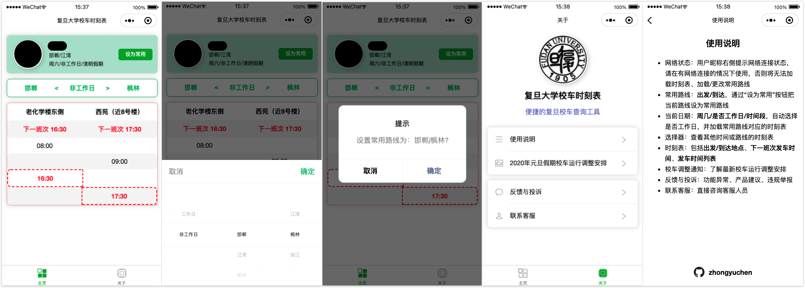

# bus-schedule


Bus schedule of Fudan University on WeChat Mini Program / 复旦大学校车时刻表微信小程序


## Screen Shot



## Features

* 网络状态：在用户昵称右侧显示网络连接状态，请在有网络连接的情况下使用，否则将无法加载时刻表、加载/更改常用路线
* 常用路线：在用户昵称下显示，格式为出发地点/目的地点，通过`设为常用`按钮可以把当前路线设为常用路线
* 当前日期：在用户昵称下显示，格式为周几/是否工作日/时间段，自动选择是否工作日/非工作日，并加载常用路线对应的时刻表
* 选择器：查看其他时间或路线的时刻表
* 时刻表：黑色粗体字为发车/下车地点，红粗体字为下一班次发车时间，黑体字为发车时间
* 校车调整通知：了解最新校车运行调整安排

## Prerequisites

* Since `wx-server-sdk` is used for cloud functions, 
`wx-server-sdk` dependencies have to be installed at __the root of every cloud function__ via the following command:
```commandline
npm install --save wx-server-sdk@latest
```

## Update Timetable

### generate and upload timetable JSON file to `timetable`

* Modify `INPUT_CSV` and `OUTPUT_JSON` in `data/tojson.py`
* Modify `PERIOD` to signify the period of the timetable
* Generate timetable json file:
```
python data/tojson.py
```
* Upload the `.json` file into database table `timetable` (for online update)
* Optional: Replace the timetable json variable in `src/static/js/timetable.js` with the new one, without the `period` key (for static usage)

### add a record in `period`

```
begin (date): start time of the period
end (date): end time of the period
name (str): the name of the period which shows on the app
period (str): period name for querying the corresponding timetable
weekday (str): weekday/weekend part of the timetable
weekend (str): weekday/weekend part of the timetable
```

## Reference

* [miniprogram-demo](https://github.com/wechat-miniprogram/miniprogram-demo)
* [picker](https://developers.weixin.qq.com/miniprogram/dev/component/picker.html)
* [WeUI](https://github.com/Tencent/weui)

## Links

* [微信公众平台](https://mp.weixin.qq.com/)
* [Map of Fudan University](http://map.fudan.edu.cn)

## Author

Zhongyu Chen
